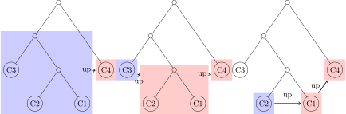

# CDE
A Scala library for Context-Dependent Environments, where a key-value environment is passed down a module hierarchy and each returned value depends on the key and the query’s origin. CDE is provably superior to existing parameterization schemes because it avoids introducing non-local source code changes when a design is modified, while also enabling features for large-scale design space exploration of compositions of generators.

## User Guide

The library presents its key-value storage under an abstract class `Parameters`. Values stored in `Parameters` are each associated with a case object extends `Field[T]`.

The main interface for user to create a `Parameters` object is using `Config` object. Its `apply` method takes `(View, View, View) => PartialFunction[Any, Any]` as a lookup table.

```scala
//Field MyKey1 contains value of type Int
case object MyKey1 extends Field[Int]
//Field MyKey2 contains value of type String, with default value "None"
case object MyKey2 extends Field[String]("None")

// The meaning of parameter (site, here, up) will be explained later
val p: Parameters = Config((site, here, up) => {
  case MyKey1 => 0
  case MyKey2 => "MyValue"
})

// Apply Paramaters object to Field to query
assert(p(MyKey1) == 0)
```

### Parameter Overrides
We can use one `Parameters` to override another. Each single `Config` is like a row in a table, while each `Field` is a column in the table. To concat two table together, we have `alter` and `orElse` methods.
`alter` puts the rhs at bottom of the table and `orElse` puts the rhs at top of the table.

A query will inspect the table from bottom to up, row by row, until it finds the first row having the key defined.

For example: `Config1.alter(Config2).alter(Config3)` yields

|  | Key1 | Key2 | Key3 |... |
| ---- | ---- | ---- | ---- | ---- |
| `Config1` | V1 | | | |
| `Config2` | V2 | V3 | | |
|`Config3` | | | V4 | |

And now `p(Key1) == V2`, `p(Key2) == V3` and `p(Key3) == V4`.

The same `Parameters` can also be defined by `Config3.orElse(Config2).orElse(Config1)`. There is also deprecated shorthand `++` for `orElse`, so `Config3 ++ Config2 ++ Config1` is also valid.

### Environment Reference
Each query contains the entire environment of where the query originates. This is pass to the lookup table of each `Config` by `(site, here, up)` arguments.

- `here` dynamically refers to the current row of the table
- `up` dynamically refers to the rows appearing up than the current row
- `site` dynamically refers to the entire table. When it gets called by `here` or `up` queries, it still refers to the **entire** table instead of current row or upper half as indicated by `here` or `up` respectively.

For example, in the following `Parameters`

| | Key1 | Key2 | Key3 | Key4 |
| ---- | ---- | ---- | ---- | ---- |
| `Config1` | 1 | `site(Key1)` | | |
| `Config2` | 2 | | `here(Key1)` | `up(Key2)` |
| `Config3` | 3 | | | |

The value for each key is

- Key1: 3, given by `Config3`
- Key2: 3, as it is value of `Key1` in the entire table
- Key3: 2, as it is value of `Key1` defined in the current row
- Key4: 3, as it is value of `Key2` defined in the upper row, which is in turn value of `Key1` defined in the table, which should be 3 as overriden by `Config3`.

If one config layer does not refer environment at all, `alterMap` and `alterPartial` can be used to avoid create a redundant `Config` object, as they accept `Map` and `PartialFunction` as their parameter.

## Implementation Details
This section discusses the internal data structure used to track environment information. Normal reader can skip the section.

`alter` and `orElse` function wraps two operand as `ChainParameters`, which forms a binary tree when `alter` are called multiple times. Query on `ChainParameters` calls `chain` method.

The `chain` method traverses the tree by wrapping the right child in `ChainView`, which records `up` for later reference, and invoking `chain` on the left child. This happens recursively until a leaf node is found. Then if the requested key is not in the node, we can turn to `chain` of currently `up` node.

The following figure illustrates a querying process of `Parameters` constructed by `C1.alter(C2).alter(C3).orElse(C4)`. `chain` is invoked on the node in blue, and `ChainView` generated is in red.


